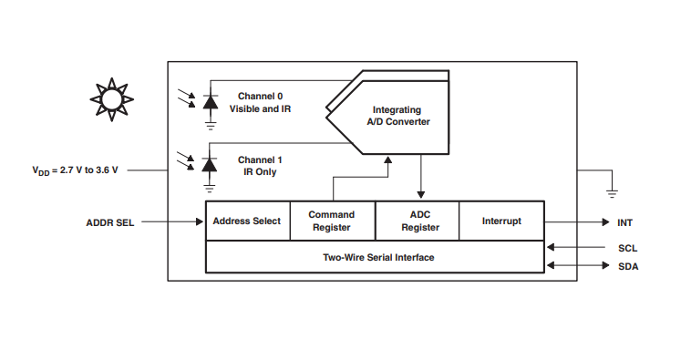

# IoT-system-controlling-lighting-in-the-building

# Introduction
Automate lighting control in your home. Set the desired illuminance and the algorithm will maintain it regardless of external conditions.
Forget about the need to turn on the light and save energy because the bulb does not always have to work at full power. 

  

The demo could also be found at YOUTUBE LINK

# Project schema

# Waveshare TSL2581FN
Waveshare TSL2581FN is a digital sensor that measures the intensity of ambient light which is supplied with a voltage from 3.3V to 5V with an I2C (Inter Integrated Circuit) interface. It has two analog-to-digital converters (ADC) that integrate currents simultaneously from two integrated photodiodes, enabling the reading of the current illuminance in a given area in the lux (lx) unit

