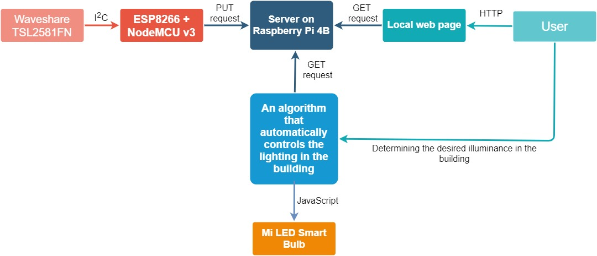

# IoT-system-controlling-lighting-in-the-building

# Introduction
Automate lighting control in your home. Set the desired illuminance and the algorithm will maintain it regardless of external conditions.
Forget about the need to turn on the light and save energy because the bulb does not always have to work at maximum power. 

  

The demo could also be found at [YOUTUBE](https://www.youtube.com/watch?v=g6M5MQARtlo)

# Project schema

  

# Waveshare TSL2581FN
Waveshare TSL2581FN is a digital sensor that measures the intensity of ambient light which is supplied with a voltage from 3.3V to 5V with an I2C (Inter Integrated Circuit) interface. It has two analog-to-digital converters (ADC) that integrate currents simultaneously from two integrated photodiodes, enabling the reading of the current illuminance in a given area in the lux (lx) unit.

  

# ESP8266 + NodeMCU v3
The platform is based on the ESP8266 chip. ESP8266 was produced by Espressif and provides a highly integrated Wi-Fi SoC (System-on-a-chip)
This module has 16 GPIO ports, however 10 of them can be used as digital I/O

  

# Connection between Waveshare TSL2581FN and ESP8266

  

# Server
The Node.js server was running on Raspberry Pi 4b. The database was launched in the MongoDB environment. 
File structure: 

  

# Lighting control algorithm
Was written also in JavaScript. The flowchart of the algorithm:

  

# Algorithm tests
A series of tests were carried out to check the correct operation of the algorithm. 
Those tests took place at night in a room in which the only light source was an algorithm controlled bulb. 
When the bulb was off, the Waveshare TSL2581FN light intensity sensor measurement was 0 [lx]. 
At the beginning of the test, the light intensity range achievable by the bulb was determined.
It was found that for the sensor located in that place the range of illuminance that can be reached is between 21-183 [lx].
Then a test was carried out in which the sensor remained in the same place all the time, 
while the user was declaring specific level of illuminance (21-183 [lx] in steps of 10 [lx]).
Test results:

  

A series of tests confirmed the correct operation of the algorithm. Moreover, it turned out that the algorithm works with high accuracy.

# Requirements
- Waveshare TSL2581FN,
- ESP8266,
- Raspberry Pi (but server can also runs on your computer if it does not bother you),
- Mi LED smart bulb,
- MongoDB.
